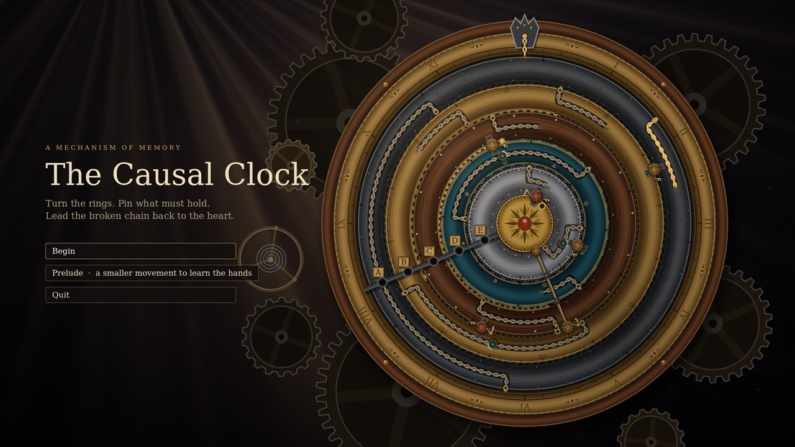
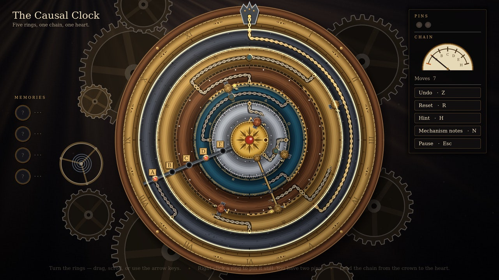
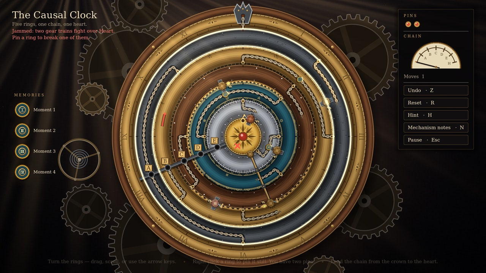
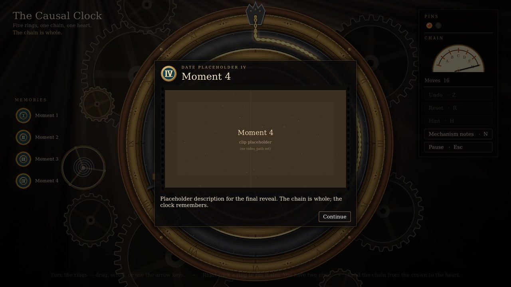

# The Causal Clock (Godot 4.3)

A standalone wrapper project for the **Causal Clock** mini-game: a mechanical
ring-alignment puzzle with geared rings, ratchets, cams, locking pins and a
swappable memory/reveal system.

Open `project.godot` in Godot 4.3 and press F5.

Everything that belongs to the mini-game lives in
[`minigames/causal_clock/`](minigames/causal_clock/README.md). That README
covers controls, the ruleset, layout authoring, replacing the placeholder
content, embedding, and tests.

| | |
|---|---|
|  |  |
|  |  |
